Screenshots
===========

Index Page
----------

Main landing page.

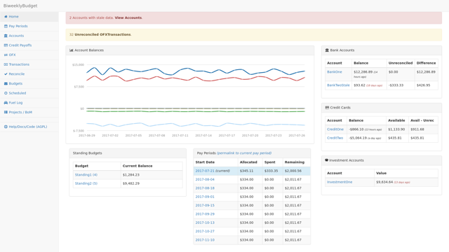

Transactions View
-----------------

Shows all manually-entered transactions.

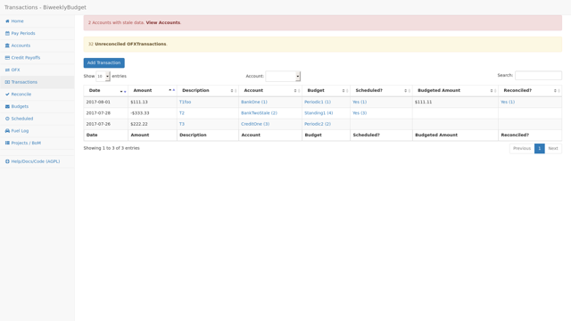

Transaction Detail
------------------

Transaction detail modal to view and edit a transaction.

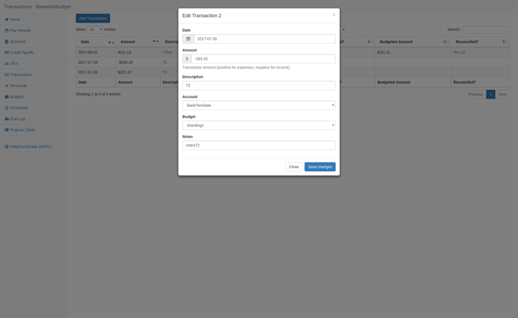

Transactions with Budget Splits
-------------------------------

A single Transaction can be split across multiple budgets.

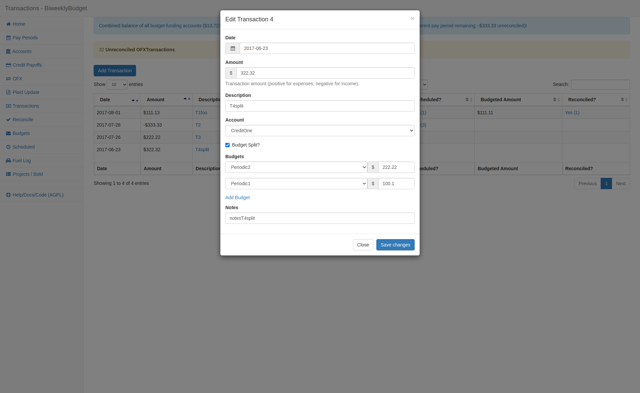

Credit Card Payoff Calculations
-------------------------------

Credit card payoff calculations based on a variety of payment methods, with configurable payment increases over time or one-time additional payment amounts.

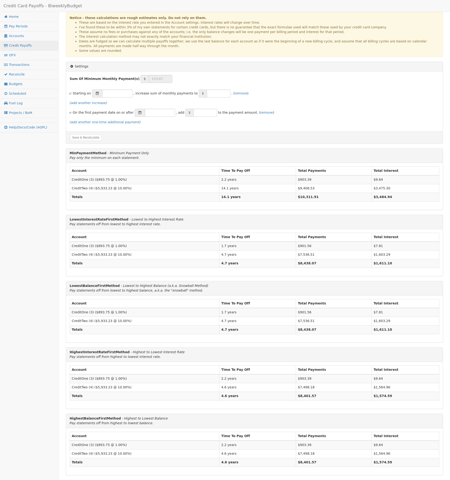

Reconcile Transactions with OFX
-------------------------------

OFX Transactions reported by financial institutions can be marked as reconciled with a corresponding Transaction.

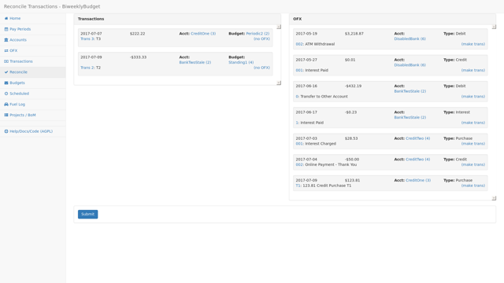

Drag-and-Drop Reconciling
-------------------------

To reconcile an OFX transaction with a Transaction, just drag and drop.

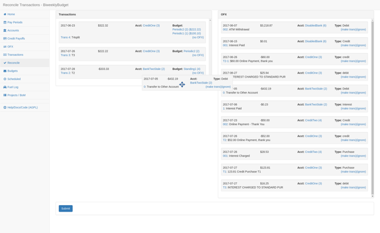

Pay Periods View
----------------

Summary of previous, current and upcoming pay periods, plus date selector to find a pay period.

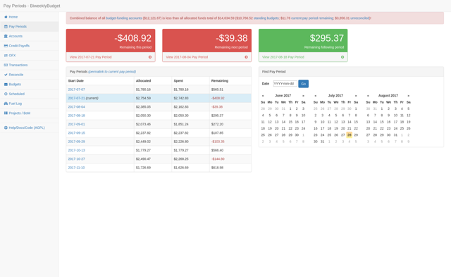

Single Pay Period View
----------------------

Shows a pay period (current in this example) balances (income, allocated, spent, remaining), budgets and transactions (previous/manually-entered and scheduled).

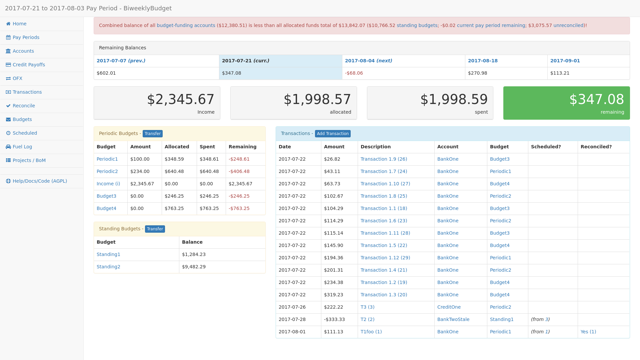

Budgets
-------

List all budgets, along with graphs of spending per budget, per payperiod and per month.

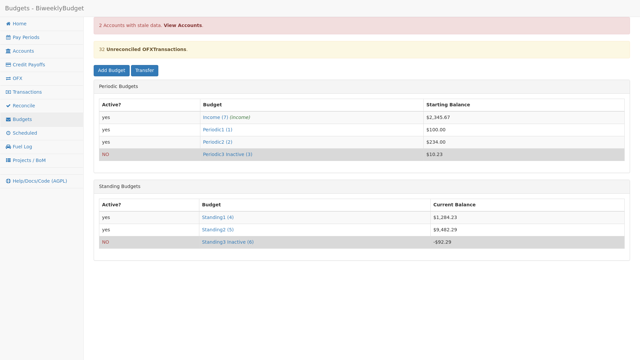

Single Budget View
------------------

Budget detail modal to view and edit a budget.

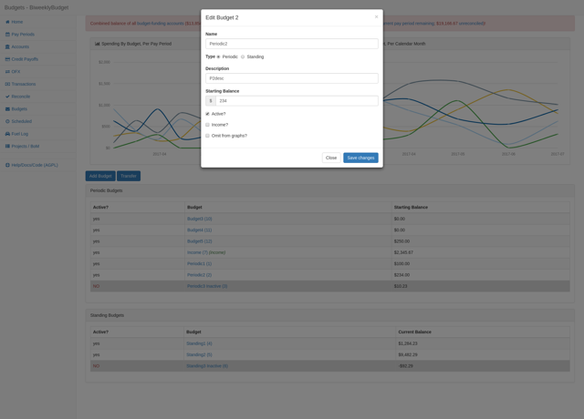

Accounts View
-------------

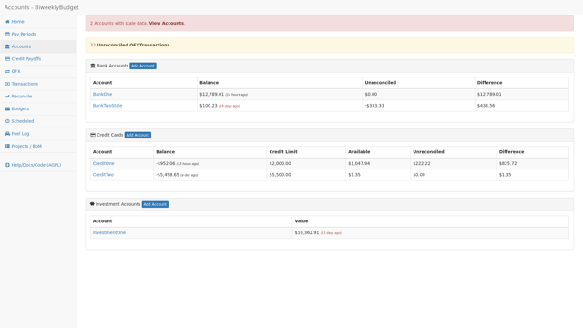

Account Details
---------------

Details of a single account.

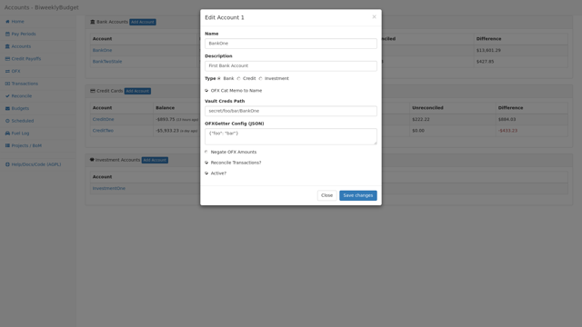

OFX Transactions
----------------

Shows transactions imported from OFX statements.

.. image:: ofx_sm.png
   :target: ofx.png

Scheduled Transactions
----------------------

List all scheduled transactions (active and inactive).

.. image:: scheduled_sm.png
   :target: scheduled.png

Specific Date Scheduled Transaction
-----------------------------------

Scheduled transactions can occur one-time on a single specific date.

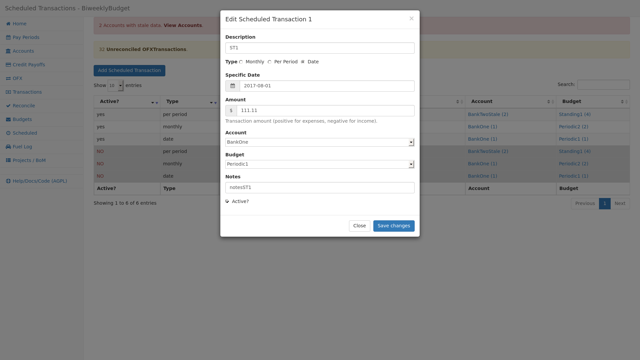

Monthly Scheduled Transaction
-----------------------------

Scheduled transactions can occur monthly on a given date.

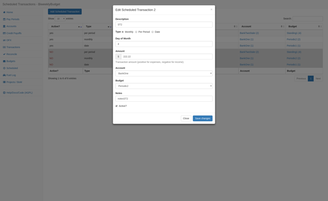

Number Per-Period Scheduled Transactions
----------------------------------------

Scheduled transactions can occur a given number of times per pay period.

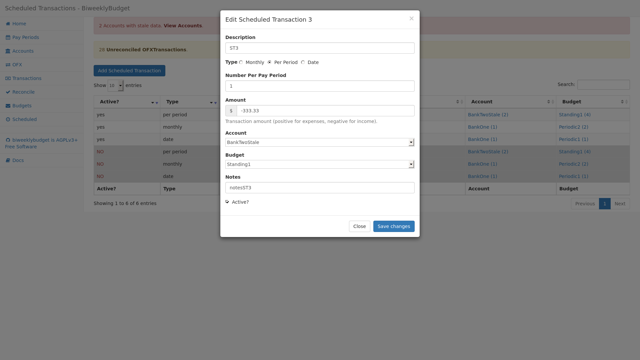

Fuel Log
--------

Vehicle fuel log and fuel economy tracking.

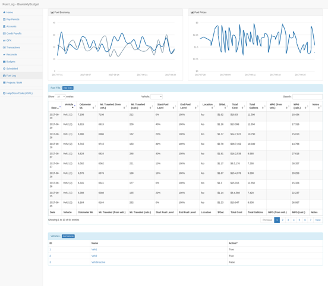

Project Tracking
----------------

Track projects and their cost.

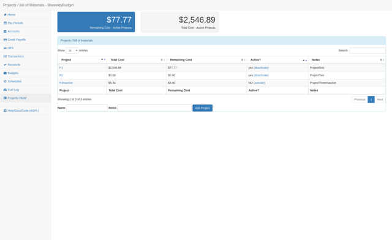

Projects - Bill of Materials
----------------------------

Track individual items/materials for projects.

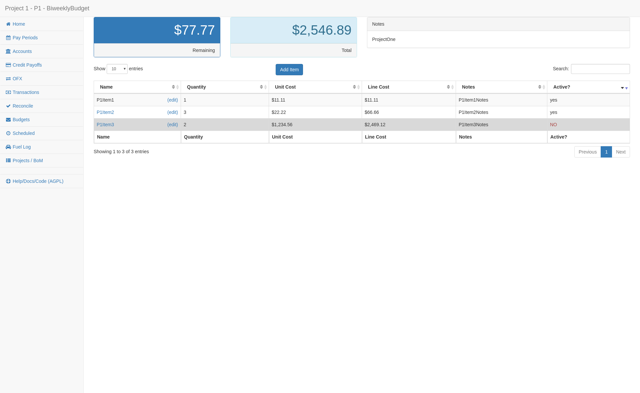

